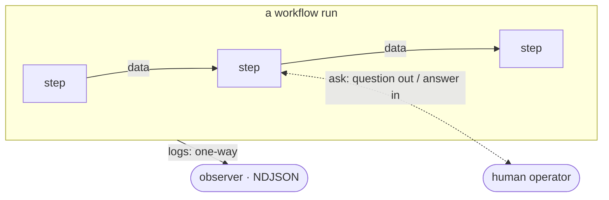

# The three channels

Every workflow run moves information along **three distinct channels**. They are
documented in depth elsewhere, but they're easy to read as unrelated features —
they aren't. Seeing them as one set is what makes a run legible: at any moment,
information in a run is doing exactly one of three things.

| Channel | Carries | Between | Read back by the run? | Typed? | Deep dive |
| --- | --- | --- | --- | --- | --- |
| **Data** (input/output) | the values the run computes | step → step (machine ↔ machine) | **yes** — the next step consumes it | yes — JSON values / declared types | [Data flow](data-flow.md) |
| **Asks** | a question out, an answer back | run ↔ the human operating it | **yes** — the answer re-enters as data | no — always a `string` | [Asking the user](ask.md) |
| **Logs** | what happened, and when | run → an outside observer | **no** — purely outward | structured NDJSON events, outside the type system | [Workflow logging](workflow-logging.md) |

## How they relate

**Data is the spine.** A run *is* the flow of data: `# inputs:` seed the scope,
each statement's value feeds the next, a tool turns params into its `# output:`,
a specialist turns a prompt into an envelope, and the last statement is the
run's result. This is the direct, in-band channel — explicit, exact, typed
information passed between things. Everything in [Data flow](data-flow.md),
[Workflow DSL](workflow-dsl.md), and [Writing tools](tools.md) is about this
channel.

**Asks branch sideways to a person, then rejoin.** An [`ask`](ask.md) is the one
point where a run leaves the machine-to-machine spine to reach the human
operating it and bring an answer back. The answer re-enters as ordinary data (a
`string`), so an ask is a detour *off* the data channel and back *onto* it — not
a third party the data flows through, but a way to source a value the workflow
couldn't compute on its own.

**Logs observe everything and feed nothing back.** [Logs](workflow-logging.md)
narrate the run's state and history for an outside observer — a human watching,
or a harness being refined afterward. This channel is **write-only from the run's
point of view**: a tool, specialist, or statement emits log events, but nothing
in the run ever reads its own logs to make a decision. Removing the log sink
changes what an observer sees, never what the run computes.

So the split is: **two channels are part of the computation** (data carries it;
asks source a missing value into it), and **one channel only reports on it**
(logs). Put differently — data and asks can change what a run does; logs cannot.

## Where each one fails

The three channels also fail in three different ways — another place the set is
easier to hold together than apart:

- **Data** fails *in-band* (a tool's `# output:` carries a `reachable: false`
  field — branch on it with `if`) or *out-of-band* (a non-zero exit — recover it
  with an [`else`](workflow-dsl.md#66-invocation-run-kind) arm, or it aborts the
  run). See [errors are data](workflow-dsl.md#7-errors-are-data).
- **Asks** fail when there's *no one to ask* — a headless run, or the user
  cancels. That's recovered with an [`else` fallback string](ask.md#4-headless-runs-recover-with-else),
  or it aborts. The *content* of an answer (including an empty string) is ordinary
  in-band data.
- **Logs** don't fail the run at all. Observability is best-effort and outward;
  a missing or unwritable log destination is a deployment concern, never a run
  outcome.

## For agents

When you're reasoning about a run, classify each piece of information by channel
first:

- Is it a **value being passed between steps**? That's the **data** channel —
  it's typed, and the [data-flow contract cards](data-flow.md) say exactly what
  goes in and out at each boundary and how it's encoded.
- Is it a **question for the person running this**? That's an **ask** — it only
  exists in workflows, always yields a `string`, and needs an `else` fallback to
  survive a headless run.
- Is it a **record of what happened**? That's a **log** — it's for an observer,
  never read back by the run, and it's the [NDJSON event stream](workflow-logging.md),
  not a return value.

If a change seems to touch "information flow," name which of the three channels
it's actually on before editing — they have different rules, different types, and
different failure semantics.
