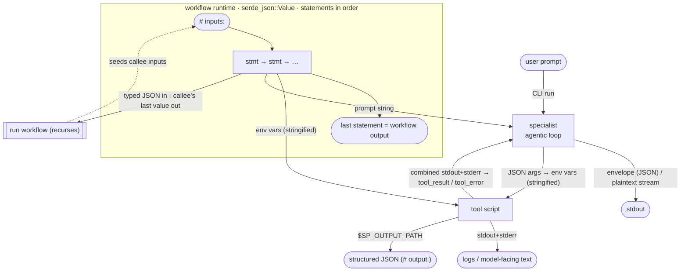

# Data flow

> The **data** channel — one of [the three channels](channels.md) a run moves
> information along (data, [asks](ask.md), [logs](workflow-logging.md)). This is
> the spine: the explicit, typed values passed step to step.

How input and output move across every boundary in spawningpool: into and out
of tools, specialists, and workflows. Each boundary below is a **contract card** —
what goes *in*, what comes *out*, how it's *encoded* on the wire, and what happens
*on failure*. Source of truth is the code; file references point at it.

This is reference material for the orchestration model. For the surface syntax see
[Workflow DSL](workflow-dsl.md); for tool scripts see [Writing tools](tools.md).

## Overview

Two encodings to keep straight, because they differ:

- **`run tool` stringifies** every argument into an environment variable.
- **`run workflow` passes typed JSON losslessly** — a `number` arrives a number,
  an object an object.

---

## CLI run → user

`spawningpool run specialist <name> --prompt 
` (`cli/src/main.rs`,
`cli/src/commands/run.rs`).

| | |
| --- | --- |
| In | a specialist name + a single user prompt string |
| Out | `--output json` (default): the **envelope** (see below) on stdout. `--output plaintext`: assistant text streamed live to the terminal |
| Encoding | envelope is one JSON object; plaintext is raw text deltas as they arrive |
| On failure | a launch/transport error exits non-zero with a message on stderr |

## Specialist agentic loop (model ↔ tool)

`run_specialist` in `spawningpool/src/run.rs`.

| | |
| --- | --- |
| In | system prompt + user prompt + the resolved tools' JSON schemas (`ToolDef::to_tool`) |
| Out | a `RunEvent` stream to the caller's observer: text/thinking (whole or streamed), `TurnDone`, `Usage`, `ToolRan`, `ToolFailed` |
| Encoding | each model turn may emit `ToolCall` blocks (`{id, name, arguments}`); arguments are JSON |
| Loop | runs until a turn emits no tool calls (final answer), or `MAX_TURNS = 16` (then errors). A **constrained** specialist makes exactly one forced call, then stops |

Per tool call, inside the loop:

| | |
| --- | --- |
| In | the call's JSON `arguments` → `args_to_vars` → **env vars** (string values verbatim; non-strings as their JSON text) |
| Out | the script's **combined stdout+stderr** → `ContentBlock::tool_result` (exit 0) or `tool_error` (non-zero / couldn't launch / unknown tool), pushed back into the message list for the next turn |
| Note | `$SP_OUTPUT_PATH` is **not** read here — the agentic loop feeds the model logs, not structured output. Structured output only matters when a workflow calls the tool |

## Tool script I/O

`run_script` in `spawningpool/src/script.rs`; header parsing in the same file.

| | |
| --- | --- |
| In | each declared `# params:` arg as an **environment variable** of the same name. Never interpolated into a command line — no shell-injection surface |
| Out (logs) | combined stdout+stderr, captured into `ScriptRun.output` |
| Out (structured) | whatever the script writes to the temp file at `$SP_OUTPUT_PATH`, captured into `ScriptRun.structured_output` (the file is read back then deleted; empty/absent → `None`). Parsed as the `# output:` type by the caller, not by the runner |
| Encoding | inputs are strings (a non-string JSON value arrives as its JSON text). Structured output is raw bytes the caller parses as JSON |
| On failure | exit 0 = success. Non-zero sets `success = false` with `code`; a signal leaves `code = None`. `# exits:` names map a code to an identifier a workflow `else` arm can branch on |

## Workflow runtime

`eval` / `eval_workflow` in `spawningpool/src/workflow/eval.rs`. Values are
`serde_json::Value` throughout.

| | |
| --- | --- |
| In | `# inputs:` supplied as a name→value map, seeded into scope before the first statement (`resolve_inputs`) |
| Out | the value of the **last statement** (v1; explicit output designation is deferred). At the CLI this prints as JSON and, when `$SP_OUTPUT_PATH` is set, is also written there — so a workflow is composable as a tool |
| Encoding | statements run top-to-bottom; each `name = expr` binds `name` for the rest of the workflow. Types are inferred, not declared |
| On failure | an unhandled error (undefined var, type mismatch, unrecovered non-zero tool exit) aborts the whole workflow |

### Workflow `run tool`

| | |
| --- | --- |
| In | the `{ KEY: expr }` map; each `expr` evaluated to JSON then **stringified** to an env var (string verbatim, else its JSON text) — same lossy encoding as the agentic loop |
| Out | the tool's `$SP_OUTPUT_PATH` contents parsed as JSON (its `# output:` type). A tool that writes nothing there is an **error** here (unlike the agentic loop, which uses logs) |
| On failure | a non-zero exit takes the matching `else` arm — keyed by the code's `# exits:` name — then the `_` default; with no matching arm the workflow aborts |

### Workflow `run specialist`

| | |
| --- | --- |
| In | the prompt expression, which must evaluate to a `string` |
| Out | the **envelope** (below). The specialist's tools are resolved from the workflow's tool set; it authenticates with its own provider's key and constrained-decoding mode |
| On failure | a run error aborts the workflow; an *unsuccessful* outcome is data — branch on `stopReason` or a tool call's `success` |

### Workflow `run workflow` (sub-workflows)

| | |
| --- | --- |
| In | the `{ KEY: expr }` map; each `expr` evaluated to a **typed JSON value and passed losslessly** as the callee's `# inputs:` — *not* stringified the way `run tool` args are |
| Out | the callee's **last statement value** (its result type, inferred recursively — a workflow has no `# output:` header) |
| On failure | a cycle (a workflow already on the call stack re-entered) is rejected via the `visited` stack rather than looping forever |

## The specialist envelope

The single shape every specialist call returns (`Collector::into_envelope`,
`spawningpool/src/workflow/collector.rs`; mirrored by the CLI's
`run --output json`). Both constrained and unconstrained specialists return it.

| Field | Type | Notes |
| --- | --- | --- |
| `output` | string | assistant text (all text blocks concatenated). An **unconstrained** answer lives here |
| `thinking` | string | reasoning text, when reasoning is enabled |
| `inputTokens` / `outputTokens` | number | summed across turns |
| `stopReason` | string | why the final turn stopped |
| `model` / `specialist` | string | what ran |
| `turns` | number | model turns taken |
| `toolCalls` | array | `{ name, success, output }` per call. A **constrained** specialist's forced call lands here — read it as `result.toolCalls.0.output` |
